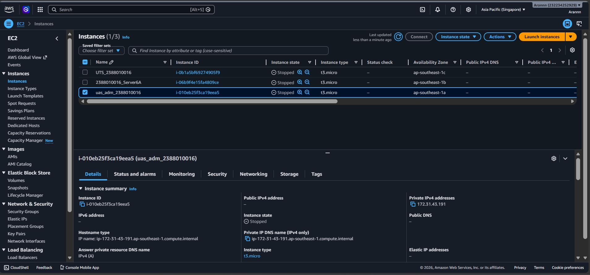
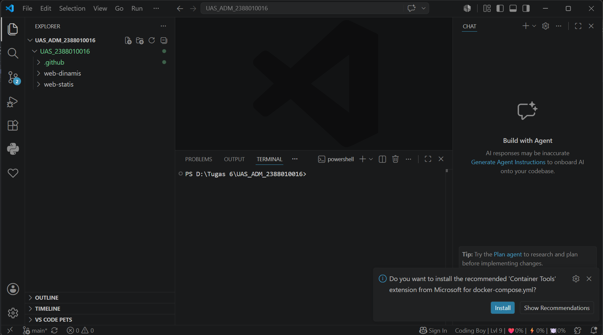
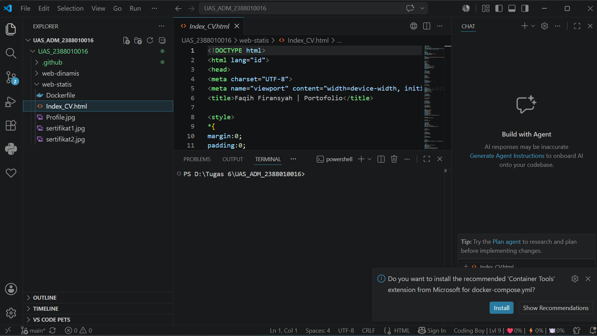
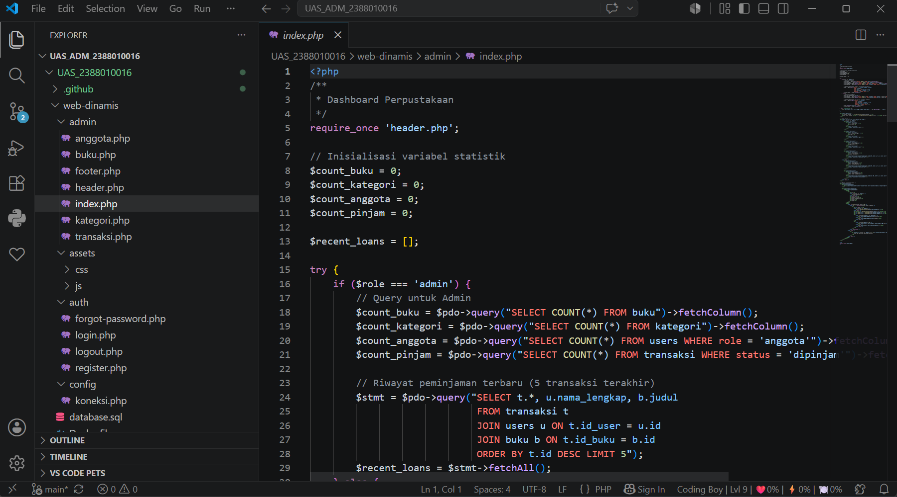
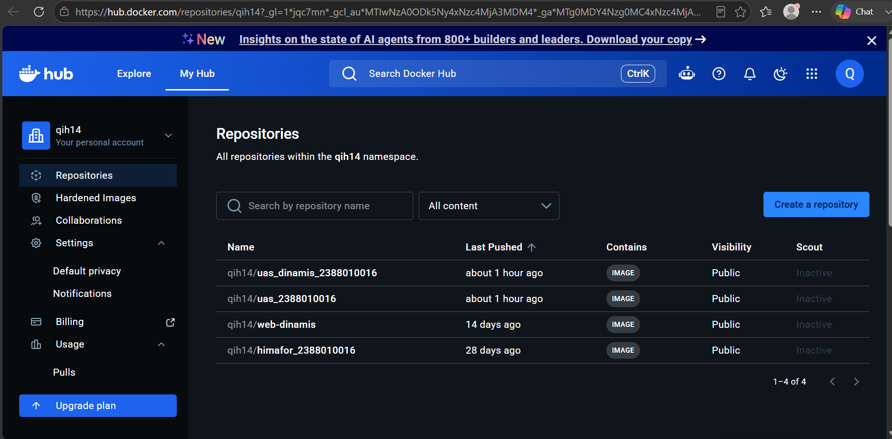
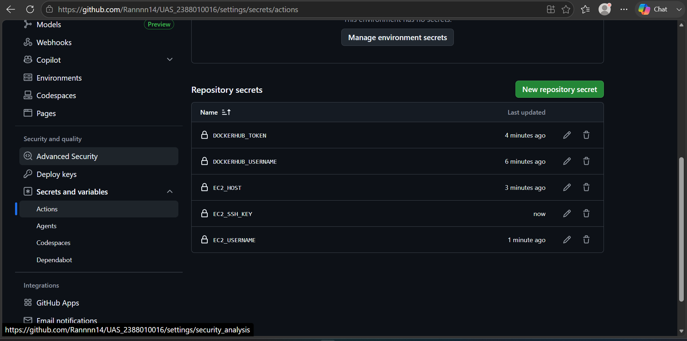
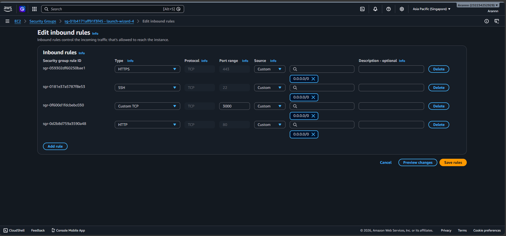
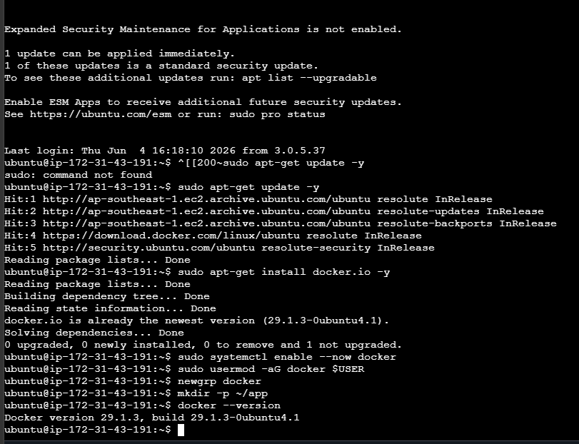
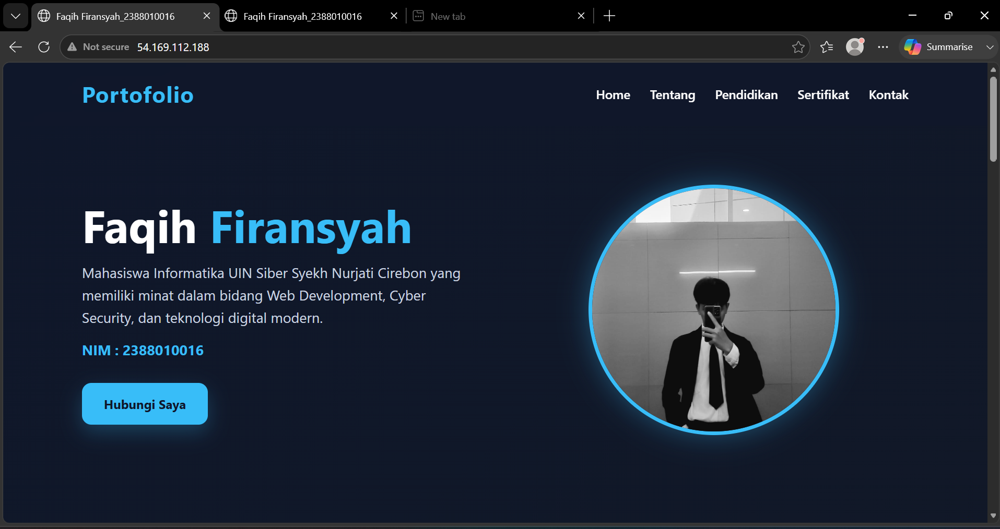
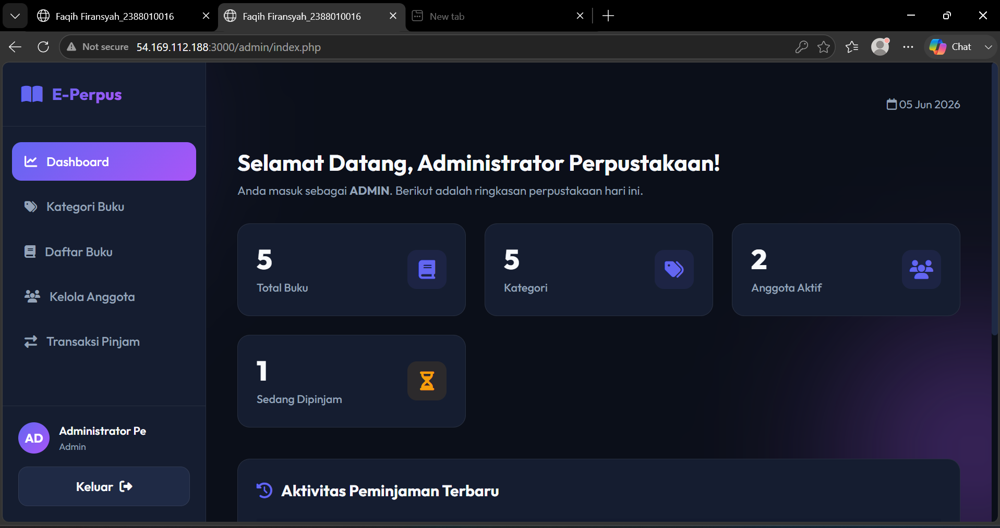

# Ujian Akhir Semester : Deploy 2 System Apps Static Web dan Dynamic Web

### 1. Membuat Insteance baru pada AWS Region ap-southeast-1 Singapore

### 2. Membuat Folder Project 

### 3. Memindahkan project web static UTS ke dalam folder project web-statis

### 4. membuat dynamic-app menggunakan php

### 5. Set Up Docker-Hub

Buat repoitory baru pada docker hub
"uas_dinamis_2388010016"
"uas_2388010016"

## Konfigurasi GitHub Repository Secrets

## Siapkan AWS EC2 Instance
A. Konfigurasi AWS Security Group

B. Hubungkan ke EC2 via SSH dan Install Docker
- Update package list

sudo apt-get update -y

- Install Docker

sudo apt-get install docker.io -y

- Aktifkan service Docker

sudo systemctl enable --now docker

- Tambahkan user saat ini ke grup docker agar tidak perlu mengetik 'sudo' di github actions

sudo usermod -aG docker $USER

newgrp docker

- Buat folder aplikasi

mkdir -p ~/app

## Jalankan & Verifikasi 
Commit dan push file

## MENJALANKAN WEB STATIS

# Menjalankan Web Dinamis

